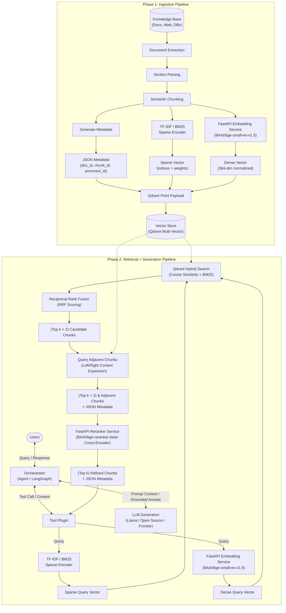

# Enterprise Hybrid RAG Architecture & Pipeline Specification

This document provides a comprehensive end-to-end technical specification for the **Two-Stage Hybrid Retrieval-Augmented Generation (RAG) Pipeline** illustrated in the system architecture diagram.

The architecture is divided into two decoupled, asynchronous pipelines:
1. **Ingestion Pipeline**: Document extraction, hierarchical chunking, dual sparse/dense vectorization (`TF-IDF` + `BAAI/bge-small-en-v1.5`), metadata extraction, and multi-vector storage into **Qdrant**.
2. **Retrieval + Generation Pipeline**: Orchestrated query routing, dual-vector query encoding, hybrid search (`Cosine Similarity + BM25`) with **Reciprocal Rank Fusion (RRF)**, **Adjacent Chunk Window Expansion**, cross-encoder reranking (`BAAI/bge-reranker-base`), and grounded **LLM Generation**.

---

## 1. System Architecture Diagram



---

## 2. Ingestion Pipeline Specification

The ingestion pipeline converts unstructured documents into hybrid-indexed, context-aware vector records stored within **Qdrant**.

```
Knowledge Base ──> Extraction ──> Sections ──> Chunks ──┬──> Generate Metadata ────────> JSON Metadata ────┐
                                                        ├──> TF-IDF ──────────────────> Sparse Vector ─────┼──> Qdrant Point
                                                        └──> FastAPI (bge-small-en) ──> Dense Vector ──────┘
```

### 2.1 Extraction & Section Parsing
- **Inputs**: PDFs, HTML pages, Markdown documents, medical wikis, EHR tables.
- **Extraction Engine**: Text and layout parsers (e.g., `PyMuPDF`, `unstructured`, `BeautifulSoup`).
- **Section Parsing**: Retains document structure, hierarchy, and header paths (e.g., `# Header 1 > ## Subheader 2`).
- **Cleaning**: Strips control characters, normalizes whitespace, standardizes medical punctuation and contractions.

### 2.2 Semantic Chunking
- **Strategy**: Recursive character or token-based splitting with sliding windows.
- **Target Chunk Size**: 300 to 512 tokens.
- **Overlap**: 50 to 80 tokens (maintains sentence integrity across chunk boundaries).
- **Sequential Indexing**: Every chunk retains strict positional references:
  - `document_id`: Unique identifier of the source document.
  - `chunk_index`: Integer 0-based sequence number within the parent document.
  - `prev_chunk_id`: UUID or hash of `chunk_index - 1` (or `null` if first).
  - `next_chunk_id`: UUID or hash of `chunk_index + 1` (or `null` if last).

### 2.3 Parallel Vectorization & Metadata Generation

Each chunk is processed concurrently across three branches:

#### Branch A: Metadata Generation
Extracts and structures chunk provenance for filtering and retrieval reconstruction:
```json
{
  "document_id": "doc_medline_dizziness_042",
  "chunk_id": "doc_medline_dizziness_042_c03",
  "chunk_index": 3,
  "total_chunks": 12,
  "prev_chunk_id": "doc_medline_dizziness_042_c02",
  "next_chunk_id": "doc_medline_dizziness_042_c04",
  "title": "MedlinePlus — Dizziness and Balance Disorders",
  "category": "health",
  "url": "https://medlineplus.gov/dizziness.html",
  "section_path": "Symptoms > Vestibular Dysfunction",
  "checked_at": "2026-10-07"
}
```

#### Branch B: Lexical Sparse Vector (TF-IDF / BM25)
- **Role**: Captures exact keyword matches, rare medical terminology, medication brand names (e.g., *Cetirizine*, *BPPV*, *Paracetamol*), and numeric codes.
- **Format**: Dictionary of sparse indices and term weights:
  $$\text{Sparse Vector} = \{ \text{indices}: [t_1, t_2, \dots, t_n], \; \text{values}: [w_1, w_2, \dots, w_n] \}$$
- **Qdrant Storage**: Inserted into Qdrant's dedicated sparse vector index (`sparse_vector` parameter).

#### Branch C: Dense Semantic Embedding (`BAAI/bge-small-en-v1.5`)
- **Service**: Dedicated FastAPI Python microservice running Hugging Face Transformers or ONNX Runtime.
- **Model**: `BAAI/bge-small-en-v1.5`
  - Dimensions: **384**
  - Context Window: 512 tokens
  - Normalization: L2 normalized vectors for Cosine Similarity
  - Query Instruction Prefix: Optional prompt prefix for asymmetric retrieval.
- **Output**: 384-dimensional dense float32 array.

### 2.4 Vector Store Ingestion (Qdrant Point)
The combined outputs are stored as a multi-vector point in **Qdrant**:

```json
{
  "id": "e4b2d184-7a13-4e3f-91a5-8b5d3c6f2a1b",
  "vector": {
    "dense": [0.0341, -0.0128, 0.0892, "... 384 floats ..."],
    "sparse": {
      "indices": [1042, 3892, 19482, 30129],
      "values": [1.42, 0.89, 2.15, 1.11]
    }
  },
  "payload": {
    "text": "Benign paroxysmal positional vertigo (BPPV) is one of the most common causes of dizziness...",
    "metadata": { "... detailed JSON metadata ..." }
  }
}
```

---

## 3. Retrieval + Generation Pipeline Specification

The retrieval and generation pipeline handles the user query at runtime, executes multi-stage hybrid search, expands contextual boundaries, reranks candidates, and grounds the LLM generation.

```
User Query ──> Orchestrator ──> Tool Plugin ──┬──> TF-IDF ────────> Sparse Query ──┐
                                              └──> FastAPI (BGE) ─> Dense Query ───┴──> Qdrant Hybrid Search (Cosine + BM25)
                                                                                                  │
                                                                                                 RRF
                                                                                                  │
                                                                                        (Top k × 2) Chunks
                                                                                                  │
                                                                                      Query Adjacent Chunks
                                                                                                  │
                                                                                (Top k × 2) & Adjacent Chunks
                                                                                                  │
                                                                                   FastAPI Reranker (bge-reranker)
                                                                                                  │
User <── Orchestrator <── LLM (Generation) <── Tool Plugin <──────────────────── (Top k) Chunks + Metadata
```

### 3.1 Orchestrator & Tool Plugin
1. **User Interaction**: User submits query (e.g., *"I have been feeling dizzy every time I get up from bed"*).
2. **Orchestrator** (LangGraph / State Machine):
   - Assesses query safety and emergency severity (e.g., screening for chest pain, stroke symptoms).
   - Routes medical/factual queries to the **Tool Plugin**.
3. **Tool Plugin**: Prepares the retrieval request, invokes encoders, executes vector queries, and coordinates reranking.

### 3.2 Dual Query Vectorization
The user query undergoes dual transformation simultaneously:
1. **Dense Query Vector**: Encoded via `BAAI/bge-small-en-v1.5` in FastAPI.
2. **Sparse Query Vector**: Processed by the TF-IDF / BM25 tokenizer to extract term weights.

### 3.3 Hybrid Search & Reciprocal Rank Fusion (RRF)
Qdrant performs dual simultaneous retrieval:
- **Dense Branch**: Cosine similarity against 384-dim dense vectors.
- **Sparse Branch**: BM25 dot-product matching against sparse inverted index.

#### Reciprocal Rank Fusion (RRF) Algorithm:
To blend results without score normalization discrepancies, RRF scores each chunk $d \in D$:

$$RRF\_Score(d) = \sum_{m \in \{dense, sparse\}} \frac{1}{k_{rrf} + \text{rank}_m(d)}$$

Where:
- $k_{rrf}$ is a smoothing constant (standard default: **60**).
- $\text{rank}_m(d)$ is the 1-based ordinal position of document $d$ in system $m$.
- Chunks appearing in both top rankings receive significantly higher combined scores.
- **Result Pool**: The top candidates are selected: **$(\text{Top } k \times 2)$ Chunks** (e.g., if $k = 4$, retrieve 8 candidate chunks).

### 3.4 Adjacent Chunk Window Expansion (Context Stitching)
Chunking often splits critical medical nuances, contraindications, or dosage tables across boundaries. The **Query Adjacent Chunks** stage fixes this:

1. For each chunk in the $(\text{Top } k \times 2)$ set, inspect `payload.metadata.prev_chunk_id` and `payload.metadata.next_chunk_id`.
2. Issue a batch lookup in Qdrant for these adjacent point IDs.
3. Merge adjacent chunks with the candidate chunk to form a coherent, continuous multi-chunk text block.
4. **Output**: **$(\text{Top } k \times 2) \text{ \& Adjacent Chunks}$**.

### 3.5 Cross-Encoder Reranking (`BAAI/bge-reranker-base`)
Bi-encoders (`bge-small-en-v1.5`) compress entire texts into single vectors, which can lose subtle cross-attention details. The reranker stage applies full cross-attention:

- **Service**: Dedicated FastAPI Python microservice running `BAAI/bge-reranker-base`.
- **Input**: Query and Candidate Text pairs:
  $$\text{Input Pair} = (\text{Query}, \text{Expanded Chunk Text}_i)$$
- **Mechanism**: Joint cross-attention across all tokens in the query and chunk simultaneously.
- **Output**: A calibrated relevance logit / score for each candidate.
- **Filtering**: Sort by relevance score descending; take top $k$ candidates: **$(\text{Top } k) \text{ Chunks}$**.

### 3.6 LLM Generation & Grounding
1. **Context Assembly**: The $(\text{Top } k)$ chunks and their JSON metadata are formatted into structured citations:
   ```markdown
   [S1] MedlinePlus — Dizziness and Balance Disorders (checked 2026-10-07)
   Excerpt: Benign paroxysmal positional vertigo (BPPV) causes brief episodes of mild to intense dizziness...
   ```
2. **Orchestrator Prompting**: System prompt strictly grounds the LLM:
   - Answer using *only* verified sources.
   - Attach bracketed citation tags `[S1]`, `[S2]` to factual statements.
   - Refuse unauthorized medical prescriptions or dosing.
   - Include clear clinical guidance and disclaimers.
3. **Response Delivery**: The verified, cited response is sent back to the user.

---

## 4. Component Comparison & Technology Matrix

| Stage | Component | Technology / Model | Function & Advantage |
|---|---|---|---|
| **Ingestion** | Extractor & Chunker | Custom Python / Recursive Splitter | Preserves document hierarchy and maintains sequential chunk pointers. |
| **Ingestion** | Metadata Service | Python JSON Schema | Stores provenance (`doc_id`, `prev_id`, `next_id`, URLs, titles). |
| **Ingestion** | Sparse Vectorizer | TF-IDF / BM25 (FastAPI / Qdrant Sparse) | Exact-match keyword recall for specific medical terms and codes. |
| **Ingestion** | Dense Embedding | `BAAI/bge-small-en-v1.5` | 384-dimensional dense semantic representation; fast and low-latency. |
| **Storage** | Vector Database | **Qdrant** | Native multi-vector support (Dense + Sparse in a single Point), payload filtering, high-throughput. |
| **Retrieval** | Hybrid Search | Cosine Similarity + BM25 | Combines semantic meaning with exact keyword matches. |
| **Fusion** | Score Aggregator | Reciprocal Rank Fusion (RRF, $k=60$) | Robust score fusion without calibrating dissimilar score distributions. |
| **Expansion** | Context Stitcher | Point ID Lookup in Qdrant | Eliminates boundary truncation by pulling neighboring context. |
| **Reranking** | Cross-Encoder | `BAAI/bge-reranker-base` | Deep query-document token interactions; removes false-positive retrievals. |
| **Generation**| Orchestrator & LLM | LangGraph / OpenRouter / Llama | Synthesizes final grounded response with verifiable citations. |

---

## 5. Reference Implementation Snippets

### 5.1 Qdrant Collection Setup (Hybrid Multi-Vector)

```python
from qdrant_client import QdrantClient
from qdrant_client.http import models

client = QdrantClient(url="http://localhost:6333")

# Create hybrid collection with both dense and sparse vectors
client.create_collection(
    collection_name="mediagent_knowledge",
    vectors_config={
        "dense": models.VectorParams(
            size=384,
            distance=models.Distance.COSINE
        )
    },
    sparse_vectors_config={
        "sparse": models.SparseVectorParams(
            index=models.SparseIndexParams(
                on_disk=False
            )
        )
    }
)
```

### 5.2 Reciprocal Rank Fusion (RRF) & Hybrid Query

```python
def compute_rrf(dense_hits, sparse_hits, k=60):
    """Computes Reciprocal Rank Fusion over dense and sparse hit lists."""
    rrf_scores = {}
    docs = {}

    for rank, hit in enumerate(dense_hits, start=1):
        doc_id = hit.id
        rrf_scores[doc_id] = rrf_scores.get(doc_id, 0.0) + (1.0 / (k + rank))
        docs[doc_id] = hit

    for rank, hit in enumerate(sparse_hits, start=1):
        doc_id = hit.id
        rrf_scores[doc_id] = rrf_scores.get(doc_id, 0.0) + (1.0 / (k + rank))
        docs[doc_id] = hit

    ranked_doc_ids = sorted(rrf_scores.keys(), key=lambda doc_id: rrf_scores[doc_id], reverse=True)
    return [docs[doc_id] for doc_id in ranked_doc_ids]
```

### 5.3 Adjacent Chunk Expansion (Context Window Expansion)

```python
def expand_adjacent_chunks(client: QdrantClient, candidate_chunks: list, collection="mediagent_knowledge"):
    """Fetches preceding and succeeding chunks to reconstitute complete section context."""
    expanded_results = []
    
    for chunk in candidate_chunks:
        payload = chunk.payload
        meta = payload.get("metadata", {})
        prev_id = meta.get("prev_chunk_id")
        next_id = meta.get("next_chunk_id")
        
        neighbor_ids = [nid for nid in [prev_id, next_id] if nid]
        neighbors = []
        if neighbor_ids:
            neighbors = client.retrieve(
                collection_name=collection,
                ids=neighbor_ids,
                with_payload=True
            )
            
        # Sort neighbors and center chunk by chunk_index
        all_chunks = [chunk] + neighbors
        all_chunks.sort(key=lambda c: c.payload.get("metadata", {}).get("chunk_index", 0))
        
        stitched_text = "\n\n".join(c.payload.get("text", "") for c in all_chunks)
        expanded_results.append({
            "primary_id": chunk.id,
            "stitched_text": stitched_text,
            "metadata": meta
        })
        
    return expanded_results
```

### 5.4 Cross-Encoder Reranking (`bge-reranker-base`)

```python
from sentence_transformers import CrossEncoder

reranker = CrossEncoder("BAAI/bge-reranker-base")

def rerank(query: str, expanded_candidates: list, top_k: int = 4):
    """Scores (query, passage) pairs and returns the top_k most relevant candidates."""
    pairs = [(query, item["stitched_text"]) for item in expanded_candidates]
    scores = reranker.predict(pairs)
    
    for item, score in zip(expanded_candidates, scores):
        item["rerank_score"] = float(score)
        
    expanded_candidates.sort(key=lambda x: x["rerank_score"], reverse=True)
    return expanded_candidates[:top_k]
```

---

## 6. Key Advantages of This Architecture

1. **High Precision + High Recall**: Dense embeddings handle conversational ambiguity and semantic paraphrasing, while TF-IDF/BM25 guarantees recall on specific pharmaceutical names and medical codes.
2. **No Context Boundary Clipping**: Adjacent chunk querying eliminates the classic RAG flaw where crucial sentences get cut off midway between adjacent chunks.
3. **Low Latency with Cross-Attention Accuracy**: Bi-encoder search in Qdrant quickly reduces millions of chunks down to $(Top\ k \times 2)$ candidates in sub-10ms, allowing the heavier cross-encoder reranker to process only a handful of candidates with pinpoint accuracy.
4. **Verifiable & Safe Medical Generation**: The orchestrator enforces grounding in the reranked chunks with strict citations (`[S1]`, `[S2]`), preventing hallucinated clinical advice.
